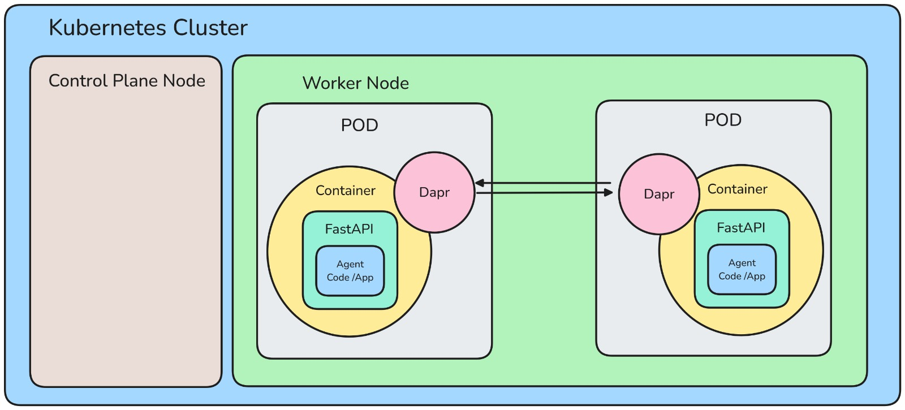

# DACA Agent-Native Cloud Local Development

This project implements a **Multi-AI Agent System** using the **Dapr Agentic Cloud Ascent (DACA)** architecture and Agent-Native Cloud Technologies. The system leverages Kubernetes for orchestration and Dapr for distributed capabilities, with AI agents as stateful Dapr Actors, FastAPI APIs for user interaction, and Pub/Sub for scalable agent communication.

## Project Structure

- **01_intro_fastapi/**: Implementation of agent endpoints using FastAPI. Includes API validation, parameter handling, and a `/chat` endpoint for DACA agents, integrated with Dapr Pub/Sub.
- **02_cloud_native_setup/**: Kubernetes configuration for DACA agents. Contains container definitions, Kubernetes manifests, and Helm charts for Dapr applications.
- **03_dapr_intro/**: Dapr integration with Pub/Sub (`pubsub.yaml`) and state management (`statestore.yaml`) for distributed agent operations.
- **04_security_fundamentals**: Implementation of basic security measures for DACA agents.
- **05_agent_actors**: Dapr Virtual Actors implementation for DACA agent functionality.
- **06_daca_workflows**: Complex AI-driven workflow orchestration for production systems.
- **07_security_advanced**: Advanced security implementations for production environments.

## Getting Started
Each module contains specific implementations and configurations. Follow the modules sequentially or jump to specific sections based on your needs.

## Kubernetes Cluster

## Service Invocation

